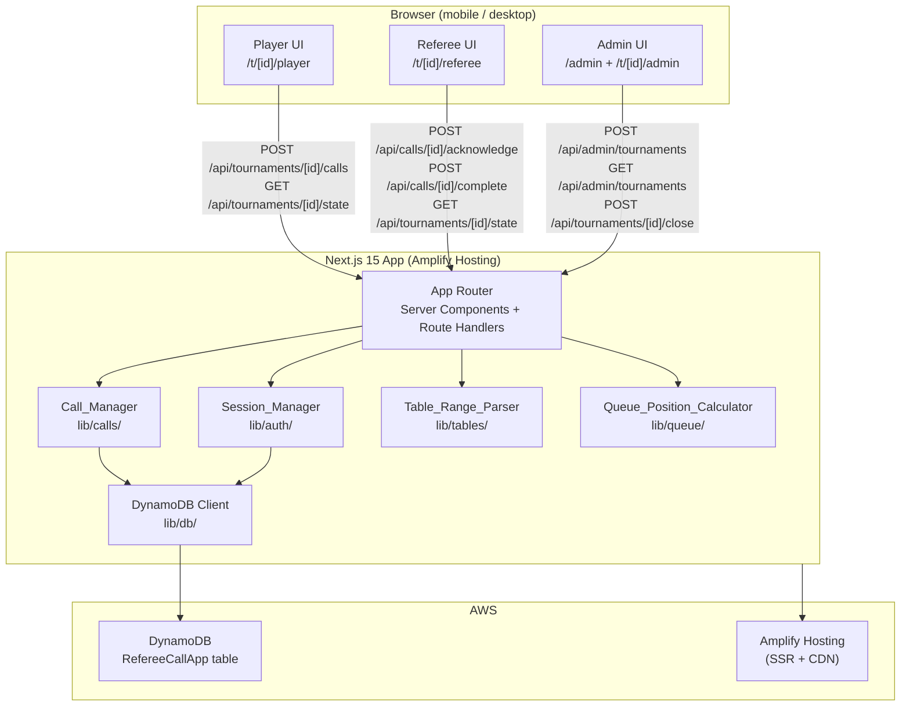
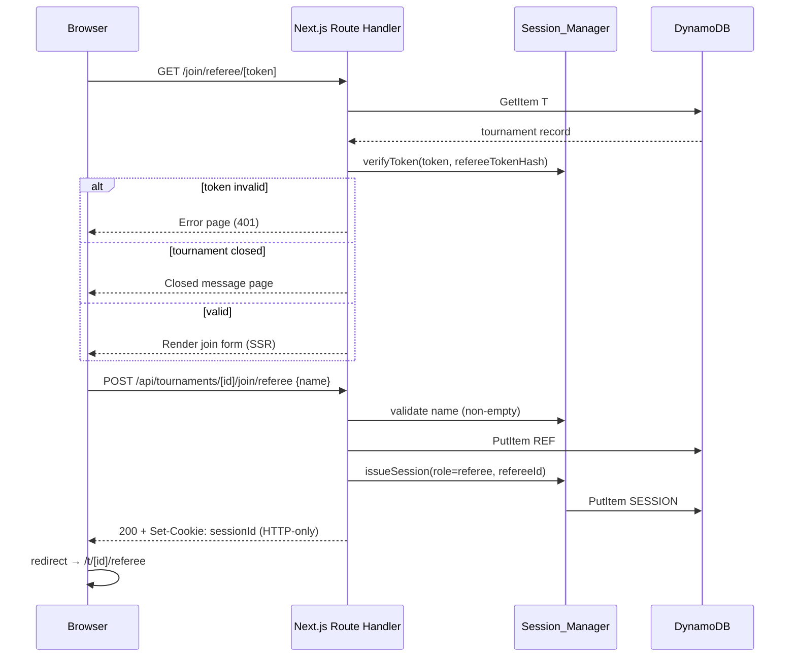
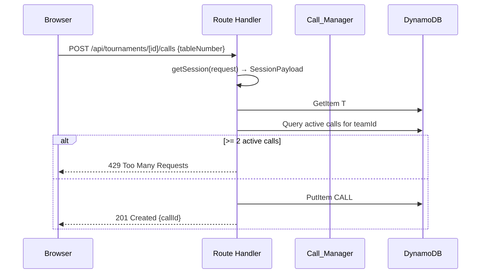
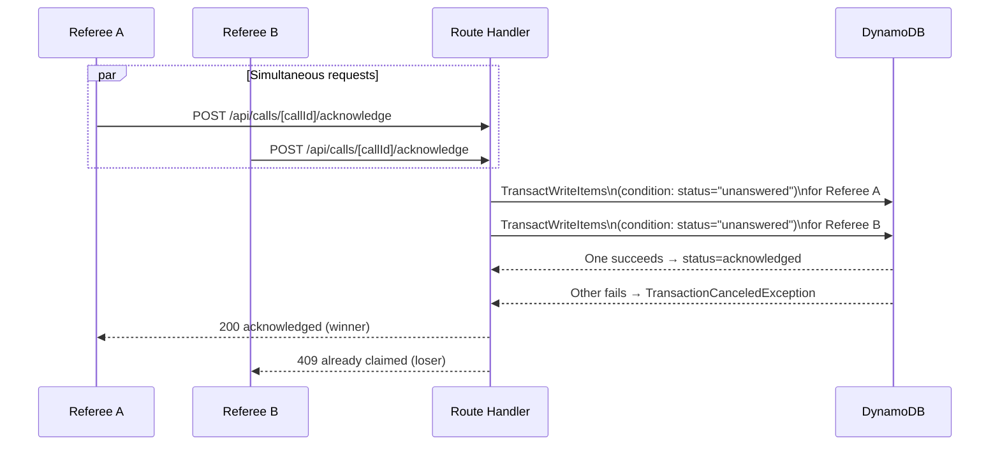
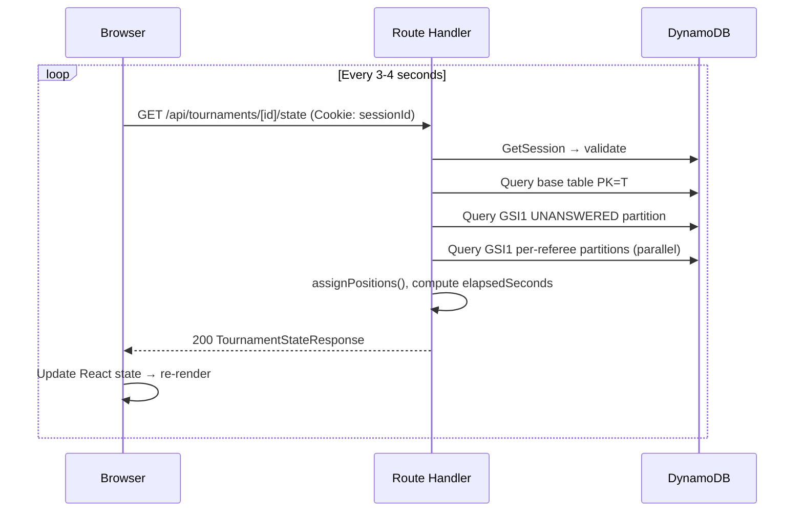

# Design Document — Pool Tournament Referee Call App

## Overview

The Pool Tournament Referee Call App is a mobile-first web application that digitises referee dispatch at pool tournaments. Players submit referee calls from their phones, referees acknowledge and complete those calls via a two-tab queue view, and admins monitor everything from a dashboard with live data.

The system is built on **Next.js 15 (App Router)** with TypeScript and Tailwind CSS, deployed via **AWS Amplify Hosting**, with all persistent state stored in a single **DynamoDB** table. There are no user accounts — all participants join via magic-link tokens distributed by the tournament admin, and identity is maintained through **HTTP-only session cookies** backed by DynamoDB session records.

### High-Level Architecture



### Key Design Decisions

| Decision | Choice | Rationale |
|---|---|---|
| Framework | Next.js 15 App Router | SSR simplifies cookie handling; route handlers co-locate API logic |
| Database | DynamoDB single-table | Low ops burden; single-digit millisecond reads; no RDS cold starts |
| Auth | Magic-link tokens + HTTP-only cookies | No passwords to manage; cookie prevents XSS token theft |
| Real-time | HTTP polling (3–4 s) | Simplest reliable approach; WebSockets add operational complexity without meaningful UX gain at this scale |
| Deployment | AWS Amplify Hosting | Handles SSR, CI/CD, env vars, and custom domains without bespoke infra |
| Concurrency | DynamoDB `TransactWriteItems` | Atomic conditional writes prevent double-acknowledge without a separate lock record |
| Token storage | SHA-256 hash only | Raw tokens are never persisted; leaked DB dump cannot yield valid join URLs |

---

## Architecture

### Project Structure

```
pool-referee-call/
├── app/
│   ├── admin/
│   │   ├── page.tsx                  # Global admin — create tournament
│   │   └── [id]/
│   │       └── page.tsx              # Tournament admin dashboard
│   ├── join/
│   │   ├── referee/[token]/page.tsx  # Referee join screen
│   │   └── player/[token]/page.tsx   # Player join screen
│   ├── t/[id]/
│   │   ├── referee/page.tsx          # Referee main view
│   │   ├── player/page.tsx           # Player main view
│   │   └── archive/page.tsx          # Closed tournament archive view
│   └── api/
│       ├── admin/
│       │   └── tournaments/route.ts  # GET + POST — global admin
│       ├── tournaments/[id]/
│       │   ├── join/
│       │   │   ├── referee/route.ts  # POST — referee join
│       │   │   └── player/route.ts   # POST — player join
│       │   ├── calls/route.ts        # POST — create call
│       │   ├── state/route.ts        # GET — poll state
│       │   ├── close/route.ts        # POST — close tournament
│       │   └── archive/route.ts      # GET — archive
│       └── calls/[callId]/
│           ├── acknowledge/route.ts  # POST — acknowledge
│           └── complete/route.ts     # POST — complete
├── lib/
│   ├── db/
│   │   ├── client.ts                 # DynamoDB DocumentClient singleton
│   │   └── queries.ts                # All typed query/mutation functions
│   ├── auth/
│   │   ├── session.ts                # Issue, read, validate session cookies
│   │   └── tokens.ts                 # SHA-256 hashing + token generation
│   ├── tables/
│   │   └── range-parser.ts           # Table_Range_Parser
│   ├── queue/
│   │   └── position.ts               # Queue_Position_Calculator
│   └── calls/
│       └── manager.ts                # Call_Manager orchestration
├── components/
│   ├── admin/
│   │   ├── CreateTournamentForm.tsx
│   │   ├── TournamentList.tsx
│   │   ├── QueueBoard.tsx            # Full dashboard queue overview
│   │   ├── RefereeQueues.tsx
│   │   └── JoinLinks.tsx
│   ├── referee/
│   │   ├── QueueTabs.tsx             # "New Calls" / "My Queue" tabs
│   │   ├── CallCard.tsx
│   │   └── StickyHeader.tsx
│   └── player/
│       ├── CallForm.tsx              # Table selector + submit button
│       └── MyCallsList.tsx
├── amplify.yml
└── infra/
    └── dynamodb.ts                   # Optional CDK stack for DDB table
```

### Request Lifecycle

Every request flows through three layers:

1. **Route Handler** — parses the request, reads the session cookie via `Session_Manager`, authorises the role, delegates to a domain function, and serialises the response.
2. **Domain Layer** (`lib/calls/`, `lib/queue/`, `lib/tables/`) — pure business logic; no HTTP concerns.
3. **Database Layer** (`lib/db/`) — typed DynamoDB commands; returns plain objects.

Server Components in `app/` use the same domain and database layers directly on the server render path, avoiding redundant API calls for initial page loads.

---

## Components and Interfaces

### Route Handlers (API Contract)

#### `POST /api/admin/tournaments`

Requires `Authorization: Bearer <ADMIN_SECRET>` header or matching cookie.

**Request body:**
```json
{
  "name": "Spring Open 2025",
  "tableRange": "11-18, 29-36"
}
```

**Response `201`:**
```json
{
  "tournamentId": "t_01J...",
  "name": "Spring Open 2025",
  "tableNumbers": [11, 12, 13, 14, 15, 16, 17, 18, 29, 30, 31, 32, 33, 34, 35, 36],
  "adminToken": "<uuid-plaintext>",
  "refereeToken": "<uuid-plaintext>",
  "playerToken": "<uuid-plaintext>",
  "joinLinks": {
    "referee": "https://example.com/join/referee/<refereeToken>",
    "player": "https://example.com/join/player/<playerToken>"
  },
  "createdAt": "2025-01-01T10:00:00.000Z"
}
```

Tokens are returned **once only** in this response; only hashes are stored.

---

#### `GET /api/admin/tournaments`

Requires `ADMIN_SECRET`. Returns an array of tournament summaries (no tokens).

---

#### `POST /api/tournaments/[id]/join/referee`

**Request body:** `{ "name": "Alice" }`

**Response `200`:** Sets `sessionId` HTTP-only cookie; returns `{ "refereeId": "...", "tournamentId": "..." }`.

---

#### `POST /api/tournaments/[id]/join/player`

**Request body:** `{ "teamName": "Team Rocket" }`

**Response `200`:** Sets `sessionId` HTTP-only cookie; returns `{ "teamId": "...", "tournamentId": "..." }`.

---

#### `POST /api/tournaments/[id]/calls`

Requires valid player session cookie.

**Request body:** `{ "tableNumber": 14 }`

**Response `201`:** `{ "callId": "c_01J...", "status": "unanswered", "createdAt": "..." }`

**Error responses:** `400` bad table number, `401` no/invalid session, `403` tournament closed, `429` at call limit.

---

#### `POST /api/calls/[callId]/acknowledge`

Requires valid referee session cookie.

**Response `200`:** `{ "callId": "...", "status": "acknowledged", "acknowledgedAt": "..." }`

**Error responses:** `401` no session, `403` closed, `409` already claimed.

---

#### `POST /api/calls/[callId]/complete`

Requires valid referee session cookie; must be the referee who acknowledged.

**Response `200`:** `{ "callId": "...", "status": "completed", "completedAt": "..." }`

**Error responses:** `401`, `403` closed or wrong referee, `409` wrong status.

---

#### `GET /api/tournaments/[id]/state`

Requires any valid session cookie for the tournament.

**Response `200`:**
```json
{
  "lastUpdatedAt": "2025-01-01T10:05:00.000Z",
  "tournament": { "name": "...", "status": "active" },
  "unansweredQueue": [
    {
      "callId": "c_01J...",
      "teamName": "Team Rocket",
      "tableNumber": 14,
      "createdAt": "...",
      "elapsedSeconds": 47
    }
  ],
  "refereeQueues": {
    "ref_01J...": {
      "refereeName": "Alice",
      "calls": [
        {
          "callId": "c_01J...",
          "teamName": "Team Hydra",
          "tableNumber": 11,
          "acknowledgedAt": "...",
          "elapsedSeconds": 23,
          "position": 1
        }
      ]
    }
  },
  "myCalls": [
    {
      "callId": "c_01J...",
      "tableNumber": 14,
      "status": "unanswered",
      "refereeName": null,
      "position": null,
      "createdAt": "..."
    }
  ]
}
```

The `myCalls` array is filtered by the session's `teamId` (players) or `refereeId` (referees, for their own queue). Admins receive all queues and an empty `myCalls`.

---

#### `POST /api/tournaments/[id]/close`

Requires `adminToken` in request body or `Authorization` header.

**Response `200`:** `{ "tournamentId": "...", "status": "closed" }`

---

#### `GET /api/tournaments/[id]/archive`

Requires `adminToken`. Tournament must be `closed`.

**Response `200`:**
```json
{
  "tournament": { "name": "...", "status": "closed", "createdAt": "..." },
  "calls": [ /* all CALL# records */ ],
  "referees": [ /* all REF# records */ ],
  "teams": [ /* all TEAM# records */ ]
}
```

---

### UI Components

#### `<CallForm />` (Player)

- Renders a `<select>` populated with the tournament's `tableNumbers`.
- Disables the submit button and shows an explanatory message when `myCalls.filter(active).length >= 2`.
- On submit, `POST /api/tournaments/[id]/calls` and appends the returned call to local state optimistically; reverts on error.
- Minimum tap target: 44 × 44 px.

#### `<MyCallsList />` (Player)

- Renders the `myCalls` array from the polling response.
- Per call: table number, status badge, referee name (if acknowledged), queue position string from `Queue_Position_Calculator`.
- Displays `lastUpdatedAt` timestamp.
- Shows empty-state message when list is empty.

#### `<QueueTabs />` (Referee)

- Two tabs: **New Calls** (`unansweredQueue`) and **My Queue** (own referee queue from `refereeQueues`).
- Sticky header shows count badges for each tab.
- Renders `<CallCard />` per item.

#### `<CallCard />` (Referee)

- Displays: table number, team name, elapsed time (ticking, updated each render from `createdAt` or `acknowledgedAt`).
- **New Calls tab**: "Acknowledge" button (44 × 44 px minimum). Triggers `POST /api/calls/[callId]/acknowledge`.
- **My Queue tab**: "Mark Complete" button. Triggers `POST /api/calls/[callId]/complete`.
- Disabled state + spinner while request is in flight.

#### `<QueueBoard />` (Admin)

- Three-column layout on ≥ 1024 px viewports: unanswered queue | referee queues | recent activity.
- Recent activity: last 20 events derived from completed/acknowledged calls sorted by `completedAt` descending.
- Stacks to single column on mobile.

#### `<JoinLinks />` (Admin)

- Displays full absolute URLs for referee and player join links.
- One-click copy-to-clipboard via `navigator.clipboard.writeText`.
- Renders a QR code SVG per link using a lightweight client-side library (`qrcode.react` or equivalent).

---

## Data Models

### DynamoDB Single-Table Design

**Table name:** `RefereeCallApp`  
**Partition key:** `PK` (String)  
**Sort key:** `SK` (String)  
**GSI1:** `GSI1PK` (String) + `GSI1SK` (String), project ALL attributes

#### Entity Shapes

**Tournament (`T#{tournamentId}` | `META`)**

```
PK              = "T#t_01J..."
SK              = "META"
name            = "Spring Open 2025"
status          = "active" | "closed"
tableNumbers    = [11, 12, ..., 36]   // Number set (sorted)
adminTokenHash  = "sha256:abc..."
refereeTokenHash= "sha256:def..."
playerTokenHash = "sha256:ghi..."
createdAt       = "2025-01-01T10:00:00.000Z"
```

**Referee (`T#{tournamentId}` | `REF#{refereeId}`)**

```
PK         = "T#t_01J..."
SK         = "REF#ref_01J..."
refereeId  = "ref_01J..."
name       = "Alice"
joinedAt   = "2025-01-01T10:01:00.000Z"
```

**Team (`T#{tournamentId}` | `TEAM#{teamId}`)**

```
PK       = "T#t_01J..."
SK       = "TEAM#team_01J..."
teamId   = "team_01J..."
name     = "Team Rocket"
joinedAt = "2025-01-01T10:02:00.000Z"
```

**Call (`T#{tournamentId}` | `CALL#{callId}`)**

```
PK             = "T#t_01J..."
SK             = "CALL#c_01J..."
callId         = "c_01J..."
teamId         = "team_01J..."
teamName       = "Team Rocket"
tableNumber    = 14
status         = "unanswered" | "acknowledged" | "completed"
refereeId      = "ref_01J..." | null
refereeName    = "Alice" | null
createdAt      = "2025-01-01T10:03:00.000Z"
acknowledgedAt = "2025-01-01T10:03:30.000Z" | null
completedAt    = "2025-01-01T10:05:00.000Z" | null
// GSI1 attributes (set on write):
GSI1PK         = "T#t_01J...#UNANSWERED"    (cleared on acknowledge)
               | "T#t_01J...#REF#ref_01J..." (set on acknowledge)
GSI1SK         = createdAt                   (unanswered)
               | acknowledgedAt              (acknowledged)
```

**Session (`T#{tournamentId}` | `SESSION#{sessionId}`)**

```
PK          = "T#t_01J..."
SK          = "SESSION#sess_01J..."
sessionId   = "sess_01J..."
role        = "referee" | "player" | "admin"
tournamentId= "t_01J..."
entityId    = "ref_01J..." | "team_01J..."  // refereeId or teamId
displayName = "Alice" | "Team Rocket"
expiresAt   = "2025-01-02T10:00:00.000Z"   // TTL attribute
```

#### GSI1 Access Patterns

| Access Pattern | GSI1PK | GSI1SK sort |
|---|---|---|
| All unanswered calls (FIFO) | `T#{id}#UNANSWERED` | `createdAt` ASC |
| All calls for referee (FIFO) | `T#{id}#REF#{refId}` | `acknowledgedAt` ASC |

When a call is acknowledged, a `TransactWriteItems` call removes the `GSI1PK`/`GSI1SK` that puts it in the unanswered partition and replaces them with the referee-specific GSI1 attributes — atomically.

When a call is completed, the GSI1 attributes are deleted so it disappears from all queues.

#### Access Pattern Summary

| Pattern | Operation | Key |
|---|---|---|
| Get tournament meta | `GetItem` | PK=`T#{id}`, SK=`META` |
| Get session | `GetItem` | PK=`T#{id}`, SK=`SESSION#{sid}` |
| Get all tournament items | `Query` | PK=`T#{id}` |
| Get unanswered queue | `Query GSI1` | GSI1PK=`T#{id}#UNANSWERED` |
| Get referee queue | `Query GSI1` | GSI1PK=`T#{id}#REF#{refId}` |
| Get team's active calls | `Query` + filter | PK=`T#{id}`, SK begins\_with `CALL#`, filter teamId + status in [unanswered, acknowledged] |
| Atomic acknowledge | `TransactWriteItems` | condition `status = unanswered` |

---

## Error Handling

### HTTP Error Taxonomy

| Status | Scenario | User-Facing Message |
|---|---|---|
| `400` | Bad input (invalid table number, malformed range) | Descriptive validation message |
| `401` | Missing, expired, or invalid session cookie | "Your session has expired — please rejoin using your link." |
| `403` | Tournament closed; wrong referee on complete | "This tournament is closed." / "You didn't acknowledge this call." |
| `409` | Call already acknowledged; duplicate acknowledge | "This call was already claimed by another referee." |
| `429` | Team at 2 active call limit | "You already have 2 active calls. Wait for one to be completed." |
| `500` | Unexpected server error | "Something went wrong. Please try again." |

### Client-Side Error Handling

- All fetch calls are wrapped in try/catch with a `useErrorBoundary`-style local error state.
- Polling errors increment a `consecutiveErrorCount`; after 3 consecutive failures the UI shows a banner: "Connection issue — retrying…" but continues polling.
- Action buttons (Acknowledge, Complete, Submit Call) enter a disabled/loading state on click, reenable on response (success or error), and show a toast/banner for errors.
- Raw `Error` objects, stack traces, or DynamoDB error codes are **never** exposed to the client.

### DynamoDB Error Handling

- `TransactionCanceledException` with `ConditionalCheckFailed` reason on acknowledge → mapped to HTTP 409.
- `ProvisionedThroughputExceededException` / `RequestLimitExceeded` → mapped to HTTP 503 with `Retry-After: 2`.
- All DynamoDB calls use the AWS SDK v3 with exponential backoff (3 retries, base 100 ms).

---

## Testing Strategy

### Dual Testing Approach

The codebase uses both **unit/example-based tests** and **property-based tests** (PBT) via [fast-check](https://fast-check.dev) (TypeScript-native PBT library).

Unit tests cover: specific examples, UI rendering snapshots, integration points between components, and single-path API route handler tests.

Property-based tests cover: universal invariants identified in the Correctness Properties section below.

### Property Test Configuration

- **Library**: `fast-check` (zero runtime dependencies, full TypeScript support)
- **Minimum iterations**: 100 per property test (`numRuns: 100` in `fc.assert`)
- **Tag format**: Each property test file opens with a comment:  
  `// Feature: pool-referee-call-app, Property N: <property_text>`
- Each correctness property maps to **exactly one** `fc.assert(fc.property(...))` call.

### Unit Test Coverage Targets

- Route handlers: happy path + each error branch per endpoint
- `Table_Range_Parser`: error cases (inverted range, empty string, non-integer)
- `Session_Manager`: cookie issuance, expiry check, role extraction
- UI components: snapshot tests for empty states, error states, and primary data states

### Integration Tests

- Round-trip: create tournament → join as referee → join as player → create call → acknowledge → complete; verify DynamoDB state at each step.
- Concurrent acknowledge: two simultaneous acknowledge requests; verify exactly one 200 and one 409.


---

## Correctness Properties

*A property is a characteristic or behavior that should hold true across all valid executions of a system — essentially, a formal statement about what the system should do. Properties serve as the bridge between human-readable specifications and machine-verifiable correctness guarantees.*

The following properties are derived from the acceptance criteria via the prework analysis above. After the initial enumeration, a reflection pass was performed to eliminate redundancy before finalising.

**Reflection notes (redundancy eliminated):**
- Requirements 3.1, 3.3, 3.4, 3.5 are all subsumed by the round-trip property (3.9) and the sorted-unique invariant. Only the two consolidated properties are kept.
- Requirements 6.3 and 17.4 state the same max-active-calls invariant at different abstraction levels — consolidated into Property 4.
- Requirements 7.2 and 7.3 both describe atomic acknowledgement — consolidated into Property 5.
- Queue position properties (16.3 and 16.4) are distinct and kept separately.

---

### Property 1: Table Range Parser — Round-Trip

*For any* valid sorted list of unique positive integers L, formatting L into a canonical comma-separated range string and then parsing that string SHALL produce a list equal to L.

**Validates: Requirements 3.1, 3.3, 3.4, 3.5, 3.9**

---

### Property 2: Table Range Parser — Sorted Unique Output Invariant

*For any* valid table range string S, the result of `parseTableRange(S)` SHALL be a list where every element is strictly greater than the previous (simultaneously guaranteeing sorted order and uniqueness).

**Validates: Requirements 3.4, 3.5**

---

### Property 3: Table Range Parser — Inverted Range Rejection

*For any* pair of positive integers (a, b) where a > b, parsing the string `"a-b"` as a range segment SHALL return a validation error, never a list.

**Validates: Requirement 3.6**

---

### Property 4: Max Active Calls Invariant

*For any* sequence of call creation attempts by a single team — regardless of how many attempts are made or in what order — the count of that team's calls in `unanswered` or `acknowledged` status SHALL never exceed 2 at any point in time.

**Validates: Requirements 6.3, 17.4**

---

### Property 5: Atomic Acknowledgement — Exactly-One Confluence

*For any* set of N concurrent acknowledge requests (N ≥ 2) targeting the same call with `status = unanswered`, exactly 1 request SHALL receive a `200` response (transitioning the call to `acknowledged`) and all remaining N-1 requests SHALL receive a `409` response, regardless of request arrival order.

**Validates: Requirements 7.2, 7.3**

---

### Property 6: Queue Position Contiguity Invariant

*For any* referee queue containing N acknowledged calls, the set of position values assigned by `Queue_Position_Calculator` to those calls SHALL equal exactly `{1, 2, ..., N}` — no gaps, no duplicates, starting from 1.

**Validates: Requirements 16.1, 16.2, 16.3**

---

### Property 7: Queue Position After Removal — Metamorphic Property

*For any* referee queue of N calls where the call at position K is removed (completed), the positions of all remaining N-1 calls SHALL form the contiguous sequence `{1, 2, ..., N-1}` with every call that was previously at a position > K decremented by exactly 1.

**Validates: Requirements 16.4, 10.2, 10.3**

---

### Property 8: Session Token Non-Reversibility

*For any* token string T generated by the system, the stored value `hash(T)` SHALL NOT equal T, ensuring the hash function is not an identity operation over the token space.

**Validates: Requirement 15.5**

---

### Property 9: Closed Tournament Mutation Rejection

*For any* tournament with `status = closed`, for every mutating request (create call, acknowledge call, complete call, referee join, player join) — regardless of whether the session is otherwise valid — the system SHALL return a non-2xx HTTP status code.

**Validates: Requirements 13.2, 13.3, 13.4**

---

## Low-Level Design

### `Table_Range_Parser` — `lib/tables/range-parser.ts`

```typescript
export type ParseSuccess = { ok: true; tables: number[] };
export type ParseError   = { ok: false; error: string };
export type ParseResult  = ParseSuccess | ParseError;

/**
 * Parses a compact table range string (e.g. "11-18, 29-36") into a
 * sorted, deduplicated list of table numbers.
 *
 * Algorithm:
 *  1. Reject empty / whitespace-only input immediately.
 *  2. Split on commas, trim each segment.
 *  3. For each segment:
 *     a. If it matches /^\d+$/ → single number.
 *     b. If it matches /^(\d+)-(\d+)$/ → range; reject if lo > hi.
 *     c. Otherwise → validation error (non-integer characters).
 *  4. Collect all numbers into a Set (deduplication), spread to array.
 *  5. Sort ascending.
 *  6. Return { ok: true, tables }.
 */
export function parseTableRange(input: string): ParseResult;

/**
 * Formats a sorted list of integers back to a canonical range string.
 * Consecutive integers are collapsed to "lo-hi" segments.
 * Example: [11,12,13,29,30] → "11-13, 29-30"
 *
 * Used in the admin UI live preview and in round-trip property tests.
 */
export function formatTableRange(tables: number[]): string;
```

**Edge cases handled:**
- `"11-11"` → valid single-number range `[11]`
- `"11-18, 11-13"` → deduplicated `[11, 12, 13, 14, 15, 16, 17, 18]`
- `"18-11"` → error: "Range segment '18-11' has lower bound greater than upper bound"
- `"1a-18"` → error: "Segment '1a-18' contains non-integer characters"
- `""` / `"   "` → error: "Table range must not be empty"

---

### `Session_Manager` — `lib/auth/session.ts`

```typescript
export interface SessionPayload {
  sessionId:    string;
  tournamentId: string;
  role:         'referee' | 'player' | 'admin';
  entityId:     string;   // refereeId or teamId
  displayName:  string;
  expiresAt:    string;   // ISO 8601
}

/**
 * Issues a new session: creates SESSION# record in DynamoDB,
 * returns a Set-Cookie header value (HTTP-only, Secure, SameSite=Lax).
 *
 * Cookie value = sessionId (UUID). The cookie is opaque — all payload
 * lives in DynamoDB.
 */
export async function issueSession(
  payload: Omit<SessionPayload, 'sessionId' | 'expiresAt'>,
  ttlHours?: number   // default: 24
): Promise<{ sessionId: string; cookieHeader: string }>;

/**
 * Reads and validates the session cookie from an incoming Request.
 * Steps:
 *  1. Extract sessionId from Cookie header.
 *  2. GetItem SESSION#{sessionId} from DynamoDB.
 *  3. If missing → null.
 *  4. If expiresAt < now() → null (treat as expired).
 *  5. Return SessionPayload.
 */
export async function getSession(
  request: Request
): Promise<SessionPayload | null>;

/**
 * Asserts that the session belongs to the expected tournament and role.
 * Throws a typed AuthError (mapped to 401/403 at route handler level).
 */
export function requireSession(
  session: SessionPayload | null,
  tournamentId: string,
  allowedRoles: SessionPayload['role'][]
): asserts session is SessionPayload;
```

**Token hashing — `lib/auth/tokens.ts`:**

```typescript
import { createHash, randomUUID } from 'crypto';

/** Generates a cryptographically random UUID token. */
export function generateToken(): string {
  return randomUUID();
}

/**
 * Produces a hex-encoded SHA-256 hash prefixed with "sha256:".
 * The prefix ensures the stored value can never equal the raw token
 * (satisfying Property 8).
 */
export function hashToken(token: string): string {
  return 'sha256:' + createHash('sha256').update(token).digest('hex');
}

/**
 * Validates a plaintext token against its stored hash in constant time
 * (using timingSafeEqual to prevent timing attacks).
 */
export function verifyToken(plaintext: string, stored: string): boolean;
```

---

### `Call_Manager` — `lib/calls/manager.ts`

```typescript
export interface CreateCallInput {
  tournamentId: string;
  teamId:       string;
  teamName:     string;
  tableNumber:  number;
}

export interface CallRecord {
  callId:         string;
  tournamentId:   string;
  teamId:         string;
  teamName:       string;
  tableNumber:    number;
  status:         'unanswered' | 'acknowledged' | 'completed';
  refereeId:      string | null;
  refereeName:    string | null;
  createdAt:      string;
  acknowledgedAt: string | null;
  completedAt:    string | null;
}

/**
 * Creates a new referee call.
 *
 * Algorithm:
 *  1. Verify tournament is active (GetItem META).
 *  2. Verify tableNumber is in tournament.tableNumbers.
 *  3. Query GSI1PK = T#{id}#UNANSWERED + filter teamId
 *     + Query GSI1PK = T#{id}#REF#{any} + filter teamId
 *     → count active calls. If >= 2, throw MaxCallsError.
 *  4. PutItem CALL#{callId} with status=unanswered,
 *     GSI1PK=T#{id}#UNANSWERED, GSI1SK=createdAt.
 *  5. Return CallRecord.
 *
 * Throws: TournamentClosedError | InvalidTableError | MaxCallsError
 */
export async function createCall(input: CreateCallInput): Promise<CallRecord>;

/**
 * Atomically acknowledges a call.
 *
 * Algorithm:
 *  1. Verify tournament is active.
 *  2. GetItem CALL#{callId} — verify it belongs to this tournament.
 *  3. TransactWriteItems:
 *       Update CALL#{callId}:
 *         SET status=acknowledged, refereeId, refereeName, acknowledgedAt
 *         REMOVE GSI1PK, GSI1SK (removes from unanswered queue)
 *         ADD GSI1PK=T#{id}#REF#{refId}, GSI1SK=acknowledgedAt
 *         CONDITION: status = "unanswered"
 *     → on TransactionCanceledException(ConditionalCheckFailed): throw AlreadyClaimedError
 *  4. Return updated CallRecord.
 *
 * Throws: TournamentClosedError | CallNotFoundError | AlreadyClaimedError
 */
export async function acknowledgeCall(
  callId:      string,
  refereeId:   string,
  refereeName: string,
  tournamentId: string
): Promise<CallRecord>;

/**
 * Marks an acknowledged call as complete.
 *
 * Algorithm:
 *  1. Verify tournament is active.
 *  2. GetItem CALL#{callId} — verify ownership (refereeId matches).
 *  3. UpdateItem:
 *       SET status=completed, completedAt=now()
 *       REMOVE GSI1PK, GSI1SK  (removes from per-referee queue)
 *       CONDITION: status = "acknowledged" AND refereeId = :refId
 *     → on ConditionalCheckFailed: determine if wrong status or wrong referee
 *  4. Return updated CallRecord.
 *
 * Throws: TournamentClosedError | WrongRefereeError | WrongStatusError
 */
export async function completeCall(
  callId:      string,
  refereeId:   string,
  tournamentId: string
): Promise<CallRecord>;
```

---

### `Queue_Position_Calculator` — `lib/queue/position.ts`

```typescript
export interface QueueEntry {
  callId:        string;
  teamId:        string;
  teamName:      string;
  tableNumber:   number;
  acknowledgedAt: string;
}

export interface PositionedQueueEntry extends QueueEntry {
  position: number;   // 1-indexed, contiguous, no gaps
}

/**
 * Assigns contiguous 1-indexed positions to a referee queue.
 *
 * Algorithm:
 *  1. Sort entries by acknowledgedAt ascending (DynamoDB GSI1SK already
 *     returns them in this order, but we sort defensively).
 *  2. Map each entry to { ...entry, position: index + 1 }.
 *  3. Return the positioned array.
 *
 * Properties guaranteed:
 *  - positions form exactly {1, ..., N} (Property 6)
 *  - after removal of element at position K, re-running this function
 *    on the remaining N-1 entries yields {1, ..., N-1} (Property 7)
 */
export function assignPositions(
  queue: QueueEntry[]
): PositionedQueueEntry[];

/**
 * Finds the position of a specific team's call in a referee's queue.
 * Returns null if the team has no call in this referee's queue.
 */
export function getTeamPosition(
  queue: PositionedQueueEntry[],
  teamId: string
): number | null;
```

---

### State Polling — `lib/db/queries.ts`

```typescript
/**
 * getTournamentState — single query fan-out for the polling endpoint.
 *
 * Algorithm:
 *  1. Query PK=T#{id} for all items (META, all CALL#, all REF#, all TEAM#).
 *     (Single Query on base table — efficient for tournaments up to ~1000 items.)
 *  2. Separate META record; extract tournament status.
 *  3. Query GSI1 GSI1PK=T#{id}#UNANSWERED (sorted by createdAt).
 *  4. For each unique refereeId in the CALL# records with status=acknowledged:
 *       Query GSI1 GSI1PK=T#{id}#REF#{refId} (sorted by acknowledgedAt).
 *  5. Run assignPositions() on each referee queue.
 *  6. Compute elapsedSeconds for each call using Date.now().
 *  7. Filter myCalls based on session role + entityId.
 *  8. Assemble and return TournamentStateResponse.
 */
export async function getTournamentState(
  tournamentId: string,
  session: SessionPayload
): Promise<TournamentStateResponse>;
```

---

## Data Flow Diagrams

### Join Flow (Referee / Player)



### Create Call Flow



### Atomic Acknowledge Flow



### State Polling Flow



